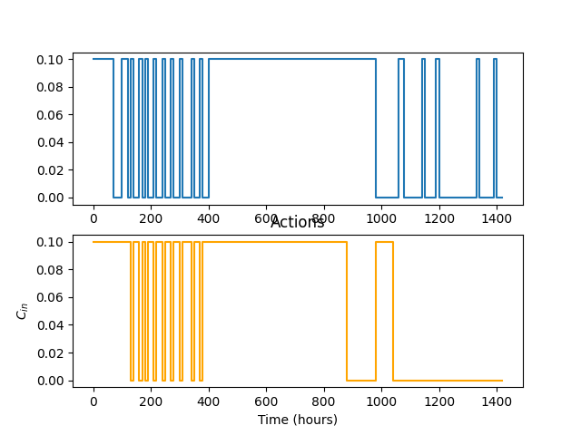
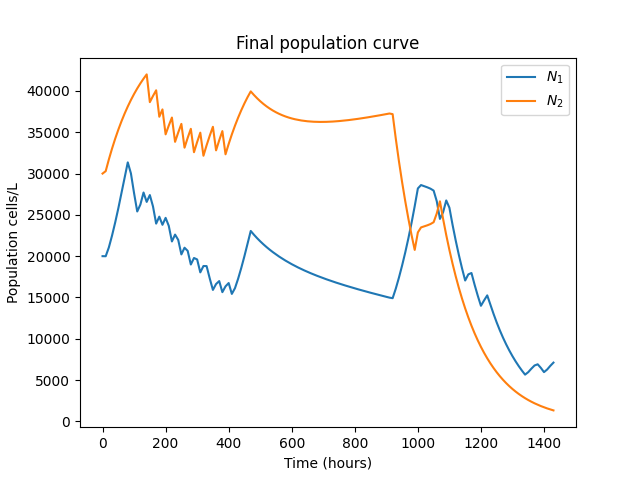
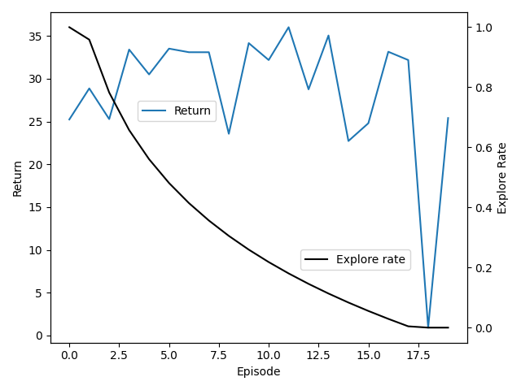

# Session 3: Deep Q network for bioreactor optimisation
* Author(s) for paper and code: Neythen J. Treloar
* Author(s) for educational material: Saba Ferdous, Ed Lowther, and  Miguel Xochicale

## Questions
* How can an agent learn Chemostat environment that can handle an arbitrary number of bacterial strains?

## Objectives
* Learn how to use Deep Q network for Chemostat environments

## Prerequisites
Session 1: Reinforcement learning with tabular value functions   
> Learn to train an agent to navigate some simple environments with limited state-action spaces. The agent could be located in one of a relatively small number of squares on a grid and was able to move either up, down, left or right. 

Session 2: Deep reinforcement learning   
> Learn to train an agent with an much larger observation space, comprising of continuous - rather than discrete - values.

## 1. Introduction 
In this notebook, we demonstrate the key parts of a DQN agent and then apply that to the maximisation of the product output of a microbial co-culture growing in a bioreactor [1].

## 2. Setting up DQN agent
### 2.1. QNetwork.   
Let's start with the creation of QNetwork using pytorch's neural network modules, using a simple feed-fordward network with two hidden layers:
```python
class QNetwork(nn.Module):
    """Represent the agent's policy model"""
    
    def __init__(self, state_size, action_size, layer1_size=64, layer2_size=64):
        """Build a network that can take a description of an environment's state and 
        output the value of available actions.
        
        Params
        =======
            state_size (int): Dimension of each state
            action_size (int): Dimension of each action
            layer1_size (int): Number of nodes in first hidden layer
            layer2_size (int): Number of nodes in second hidden layer
        """
        super(QNetwork, self).__init__() ## calls __init__ method of nn.Module class
        self.layer1 = nn.Linear(state_size, layer1_size)
        self.layer2 = nn.Linear(layer1_size, layer2_size)
        self.layer3 = nn.Linear(layer2_size, action_size)

    def forward(self, x):
        """Map state -> action values."""
        x = F.relu(self.layer1(x))
        x = F.relu(self.layer2(x))
        return self.layer3(x)
```

### 2.2 Memory.    
For classification tasks each sample data require to be independent to any other data samples. 
However for reinforcement learning the training samples are temporarilly correlated and **not** drawn from stationary distrubtions.
Hence, the `ReplayerBuffer` method stores experiences of the agent to create mini-batches of training data from randomly sample experiences.
`ReplayerBuffer` use helpers from Python's `collections` module: (1) `deque`, similar to `list` that set maximum length using `buffer_size` and (2) `namedtuple` which makes `tuple` more readable using name fields instead of numeric indexs.
```python
class ReplayBuffer:
    """Fixed-size buffer to store experience tuples"""
    
    def __init__(self, action_size, buffer_size, batch_size):
        """Initialize a ReplayBuffer object

        Params
        ======
            action_size (int): dimension of each action
            buffer_size (int): maximum size of buffer
            batch_size (int): size of each training batch
        """

        self.action_size = action_size
        self.memory = deque(maxlen=buffer_size)
        self.batch_size = batch_size
        self.experience = namedtuple("Experience", field_names=["state",
                                                                "action",
                                                                "reward",
                                                                "next_state",
                                                                "done"])

    def add(self,state, action, reward, next_state,done):
        """Add a new experience to memory"""
        e = self.experience(state, action, reward, next_state, done)
        self.memory.append(e)

    def sample(self):
        """Randomly sample a batch of experiences from memory"""
        experiences = random.sample(self.memory, k=self.batch_size)

        states = torch.from_numpy(np.vstack([e.state for e in experiences if e is not None])).float().to(device)
        actions = torch.from_numpy(np.vstack([e.action for e in experiences if e is not None])).long().to(device)
        rewards = torch.from_numpy(np.vstack([e.reward for e in experiences if e is not None])).float().to(device)
        next_states = torch.from_numpy(np.vstack([e.next_state for e in experiences if e is not None])).float().to(device)
        dones = torch.from_numpy(np.vstack([e.done for e in experiences if e is not None]).astype(np.uint8)).float().to(device)

        return (states, actions, rewards, next_states, dones)

    def __len__(self):
        """Return the current size of internal memory"""
        return len(self.memory)
```

### 2.3. Configuration of the `DQN_agent()` 
We can configurate how the agent learns from its environment with the following variables:
* The variable `TAU` enable us to perform soft updates on the parameters of the $Q_{target}$ network, so that they shift towards the $Q$ network parameters incrementally rather than duplicate them at a single time step (e.g., 0.001).
* The variable `UPDATE_EVERY` relates to the frequency with which we perform both the gradient descent step on the $Q$ network parameters and the soft update of the $Q_{target}$ parameters (e.g., 4).
* The variable `BUFFER_SIZE` set replay buffer size (e.g., 100000).
* The variable `BATCH_SIZE` for minibatch size (e.g., 64).
* The variable `GAMMA` is discount factor (e.g., 0.99).
* The variable `LR` is the learning rate (e.g., 0.0005).

#### 2.3.1 Initialisation
`DQN_agent` contains two instances of `Qnetwork`: $Q$ and $Q_{target}$ and adam optimiser for $Q$ network which copies parameters to $Q_{target}$ network and replay memory with `ReplayerBuffer()` class.

#### 2.3.2. `get_explore_rate`
`get_explore_rate` computes the epsilon in the agent's epsilon-greedy policy based on the current episode, `episode`, and decay value that controls the rate of decay of the explore rate.

#### 2.3.3. `epsilon_greedy_policy`
`epsilon_greedy_policy` returns an action for given the current state and the epsilon-greedy action selection

#### 2.3.4. `update_target(self, model, target_model)`
Update target model parameters with weights will be copied from local model  to target model

#### 2.3.5. `update_Q(self, experiences)`
`update_Q` function train our Q network with a sample of experiences from the agent's memory using the discount factor, `GAMMA`.

#### 2.3.6. `train(self, n_episodes=200, max_t=1000, decay=None, verbose=True)`
Then we have our training function, adding and sampling from the agent's memory.

```python
class DQN_agent():
    """Agent that interacts with and learns from an environment using artificial neural networks 
    to approximate its state-action value function"""

    def __init__(self, 
                 env, 
                 state_size, 
                 action_size,
                 BUFFER_SIZE = int(1e5),
                 BATCH_SIZE = 64,
                 GAMMA = 0.99,
                 TAU = 1e-3,
                 LR = 5e-4,
                 UPDATE_EVERY = 4):
        """Initialize an Agent object

        Params
        =======
            env: an environment object
            state_size (int): dimension of each state
            action_size (int): dimension of each action
            BUFFER_SIZE = int(1e5)  # replay buffer size
            BATCH_SIZE = 64         # minibatch size
            GAMMA = 0.99            # discount factor
            TAU = 1e-3              # for soft update of target parameters
            LR = 5e-4               # learning rate
            UPDATE_EVERY = 4        # how often to update the network
        """

        self.env = env
        self.state_size = state_size
        self.action_size = action_size
        self.BUFFER_SIZE = BUFFER_SIZE
        self.BATCH_SIZE = BATCH_SIZE
        self.GAMMA = GAMMA
        self.TAU = TAU
        self.LR = LR
        self.UPDATE_EVERY = UPDATE_EVERY
        
        # Function approximation networks:
        self.q_network = QNetwork(state_size, action_size).to(device)
        self.q_network_target = QNetwork(state_size, action_size).to(device)

        # Optimise the parameters in the Q network, using the learning rate defined above
        self.optimizer = optim.Adam(self.q_network.parameters(), lr=self.LR)

        # Replay memory
        self.memory = ReplayBuffer(action_size, self.BUFFER_SIZE, self.BATCH_SIZE)
        # Initialize time step (for updating every UPDATE_EVERY steps)
        self.t_step = 0

    def get_explore_rate(self, episode, decay):
        """Calculates the logarithmically decreasing explore rate

        Params
        ======
            episode (int): the current episode
            decay (float): controls the rate of decay of the explore rate
        
        Returns
        =======
            explore_rate (float): the epsilon in the agent's epsilon-greedy policy
        """

        # Input validation
        if not 0 < decay:
            raise ValueError("decay needs to be above 0")
        
        # Ensure rate returned is between 0 and 1:
        min_explore_rate = 0
        max_explore_rate = 1
        explore_rate = 1.0 - math.log10(episode / decay)
        return max(min_explore_rate, min(max_explore_rate, explore_rate))
    
    def policy(self, state, epsilon=0):
        """Returns action for given state as per current policy

        Params
        ======
            state (array_like): current state
            epsilon (float): for epsilon-greedy action selection
        """

        state = torch.from_numpy(state).float().unsqueeze(0).to(device)
        self.q_network.eval()
        with torch.no_grad():
            action_values = self.q_network(state)
        self.q_network.train()

        # Epsilon-greedy action selction
        if random.random() > epsilon:
            return np.argmax(action_values.cpu().data.numpy())
        else:
            return random.choice(np.arange(self.action_size))

    def update_target(self, model, target_model):
        """Update target model parameters

        Params
        =======
            local model (PyTorch model): weights will be copied from
            target model (PyTorch model): weights will be copied to
        """
        for target_param, local_param in zip(target_model.parameters(), model.parameters()):
            target_param.data.copy_(self.TAU*local_param.data + (1-self.TAU)*target_param.data) 

    def update_Q(self, experiences):
        """Update value parameters using given batch of experience tuples.
        
        Params
        =======
            experiences (Tuple[torch.Variable]): tuple of (s, a, r, s', done) tuples
        """
        states, actions, rewards, next_states, dones = experiences
        
        # We use mean squared error as the loss function
        criterion = torch.nn.MSELoss()
        # The local model is the one we need to train so we put it in training mode
        self.q_network.train()
        # Conversely, we want the target model to be in evaluation mode so that when 
        # we do a forward pass it does not calculate the gradients
        self.q_network_target.eval()
        
        with torch.no_grad():
            future_pred = self.q_network_target(next_states).detach().max(1)[0].unsqueeze(1)

        # .detach() ->  Returns a new Tensor, detached from the current graph.
        targets = rewards + (self.GAMMA * future_pred * (1 - dones))

        # Shape of output from the model (batch_size, action_size) 
        predicted_targets = self.q_network(states).gather(1, actions)

        loss = criterion(predicted_targets, targets).to(device)
        self.optimizer.zero_grad()
        loss.backward()
        self.optimizer.step()

    def train(self, n_episodes=200, max_t=1000, decay=None, verbose=True):
        """Deep Q-Learning
        
        Params
        ======
            n_episodes (int): maximum number of training epsiodes
            max_t (int): maximum number of timesteps per episode
            decay (float): controls the rate of decay of the explore rate
            verbose (bool): whether to print updates on the training process
        
        Returns
        =======
            returns (list[float]): episode returns for analysis of training performance
        """
        returns = [] # list containing total reward from each episode

        # Reasonable default value for explore_rate decay:
        if not decay:
            decay = n_episodes / 11

        for episode in range(1, n_episodes+1):
            explore_rate = self.get_explore_rate(episode, decay)
            state, prob = self.env.reset()
            episode_return = 0

            for t in range(max_t): 
                action = self.policy(state, explore_rate)
                next_state, reward, done, info, prob = self.env.step(action)

                self.memory.add(state, action, reward, next_state, done)
                # If enough samples are available in memory, get random subset and learn:
                if len(self.memory) > self.BATCH_SIZE and t % self.UPDATE_EVERY == 0:
                    experience = self.memory.sample()
                    self.update_Q(experience)
                    self.update_target(self.q_network, self.q_network_target)
                state = next_state
                episode_return += reward
                if done:
                    break
        
            returns.append(episode_return)
            # If verbose mode is switched on, log returns every 10 episodes:
            if verbose and episode % 10 == 0:
                print(f'Episode {episode}\tExplore rate {explore_rate:.2f}\tReturn {episode_return:.2f}')
        
        return returns

```

## 3. Creation of Bioreactor Environment
The class `BioreactorEnv()` create a chemostat environment that can handle an arbitrary number of bacterial strains where all are being controlled.

### 3.1 Initialisation
* The variable `xdot` represents an array of the derivatives for all state variables.
* The variable `reward_func` calculate the regard function based on state, action and next state.
* The variable `sampling_time` defines the time between samples and hold intervals.
* The variable `num_controlled_species` its self explanatory.
* The variable `initial_x` represents the initial state (e.g., shape array (8,))
* The variable `max_t` represents the maximum number of timesteps per episode.
* The variable `n_states` represents the number of states (e.g., 10).
* The variable` n_actions` represents the number of actions (e.g., 2).
* The variable `continuous_s` is a boolean flag when `True` returns scaled bacterial populations (1/100000). E.g.,:`[0.26154319 0.2205354 ], otherwise, discretises the population of bacteria to a state suitable for the agent.

### 3.2 `step(self, action)`
The `step` module performs one sampling and hold interval using the action provided by a reinforcment learning agent, returning state, reward and boolean variable.

### 3.3 `action_to_u(self,action)`
The `action_to_u` module takes a discrete action index and returns the corresponding continuous `Cin` concentrations of the chosen action.

### 3.4 `get_state(self)`
The `get_state` module obtains the state, scaled bacterial populations, to be observed by the agent.

### 3.5 `pop_to_state(self, N)`
The `pop_to_state` module discretises the population of bacteria to a state suitable for the agent.

### 3.6 `reset(self, initial_x = None)`
The `reset` module resets the environment to its inital state.

```python
class BioreactorEnv():
    '''
    Chemostat environment that can handle an arbitrary number of bacterial strains where all are being controlled
    '''
    def __init__(self, 
                 xdot, 
                 reward_func, 
                 sampling_time, 
                 num_controlled_species, 
                 initial_x, 
                 max_t, 
                 n_states = 10, 
                 n_actions = 2, 
                 continuous_s = False):
        '''
        Parameters:
            xdot: array of the derivatives for all state variables
            reward_func: function to calculate reward: reward = reward_func(state, action, next_state)
            sampling_time: time between sampl-and-hold intervals
            num_controlled_species: 2
            initial_x: the initial state (e.g., shape array (8,))
            max_t: maximum number of timesteps per episode
            n_states = 10
            n_actions = 2
            continuous_s=
			True:  get_state self.xs[-1][0:self.num_controlled_species]/100000
			False: get_state = self.pop_to_state(self.xs[-1][0:self.num_controlled_species])
        Returns:
            env returns populations/scaling to agent
        References:
            https://github.com/ucl-cssb/ROCC/blob/master/ROCC/chemostat_env/chemostat_envs.py
        '''
        one_min = 0.016666666667 #(1/60)
        self.scaling = 1 #population scaling to prevent neural network instability in agent, aim to have pops between 0 and 1. 
        self.xdot = xdot
        self.xs = [] # append odeint solutions of xdot
        self.us = [] # append actions
        self.sampling_time = sampling_time*one_min
        self.reward_func = reward_func

        self.u_bounds = [0,0.1]
        self.N_bounds = [0, 50000]

        self.u_disc = n_actions
        self.N_disc = n_states
        self.num_controlled_species = num_controlled_species
        self.initial_x = initial_x
        self.max_t = max_t
        self.continuous_s = continuous_s
    
    def step(self, action):
        '''
        Performs one sampling and hold interval using the action provided by a reinforcment learning agent

        Parameters:
            action: action chosen by agent
        Returns:
            state: scaled state to be observed by agent
            reward: reward obtained buring this sample-and-hold interval
            done: boolean value indicating whether the environment has reached a terminal state
        '''
        
        u = self.action_to_u(action)
        
        #add noise
        #Cin = np.random.normal(Cin, 0.1*Cin) #10% pump noise

        self.us.append(u)

        ts = [0, self.sampling_time]
        sol = odeint(self.xdot, self.xs[-1], ts, args=(u,))[1:]
        self.xs.append(sol[-1,:])
        self.state = self.get_state() #scaled bacterial populations
        reward, done = self.reward_func(self.xs[-1]) #reward func with last appended sol from 0 to max_t
        
        if len(self.xs) == self.max_t:
            done = True

        return self.state, reward, done, None, 1

    def action_to_u(self,action):
        '''
        Takes a discrete action index and returns the corresponding continuous state vector

        Paremeters:
            action: the descrete action
            num_species: the number of bacterial populations
            num_Cin_states: the number of action states the agent can choose from for each species
            Cin_bounds: list of the upper and lower bounds of the Cin states that can be chosen
        Returns:
            state: the continuous Cin concentrations correspoding to the chosen action
        '''

        # calculate which bucket each eaction belongs in
        buckets = np.unravel_index(action, [self.u_disc] * self.num_controlled_species)

        # convert each bucket to a continuous state variable
        u = []
        for r in buckets:
            u.append(self.u_bounds[0] + r*(self.u_bounds[1]-self.u_bounds[0])/(self.u_disc-1))

        u = np.array(u).reshape(self.num_controlled_species,)
        return np.clip(u, self.u_bounds[0], self.u_bounds[1])


    def get_state(self):
        '''
        Gets the state (scaled bacterial populations) to be observed by the agent

        Returns:
            scaled bacterial populations (1/100000). E.g.,:`[0.26154319 0.2205354 ]`
        '''
        if self.continuous_s:
            return self.xs[-1][0:self.num_controlled_species]/100000
        else:
            return self.pop_to_state(self.xs[-1][0:self.num_controlled_species])

    
    def pop_to_state(self, N):
        '''
        discritises the population of bacteria to a state suitable for the agent

        :param N: population
        :return: discitised population
        '''
        step = (self.N_bounds[1] - self.N_bounds[0])/self.N_disc
        N = np.clip(N, self.N_bounds[0], self.N_bounds[1]-1)
        return np.ravel_multi_index((N//step).astype(np.int32), [self.N_disc]*self.num_controlled_species)

    def reset(self, initial_x = None):
        '''
        Resets env to inital state:

        Parameters:
            initial_S (optional) the initial state to be reset to if different to the default
        Returns:
            The state to be observed by the agent
        '''
        
        if initial_x is None:
            initial_x = self.initial_x

        self.xs = [initial_x]
        self.us = []
        return (self.get_state(),1)

```

## 4. Setting up chemostat environment and `DQN_agent` and train `DQN_agent`

## 5. Results

  
**Fig** Actions

  
**Fig** Population cells 

  
**Fig** Return and explore rate


## 6. Assignments 
1. Change intervals of reward_function using "[N1, N2] = [20, 30] × 10^9 cells L−1." to add your conclusions on how the performance of the agent improves or worsened and the explore rate decreases during training. Plot results with returns and explore_rates).
2. How `N_1` and `N_2` from env.xs maintain optimal level for product production (plot results with plt.plot(np.arange(len(env.xs)) `sampling_time`, [x[0] for x in env.xs], label = '$N_1$')).
3. How RL agent is affected if you use "infrequent sampling" (see (Treloar et al, 2020) for further details on infrequent sampling )?

## 7. References
> [1] Treloar, Neythen J., Alex JH Fedorec, Brian Ingalls, and Chris P. Barnes. "Deep reinforcement learning for the control of microbial co-cultures in bioreactors." PLoS computational biology 16, no. 4 (2020): e1007783. [DOI](https://journals.plos.org/ploscompbiol/article?id=10.1371/journal.pcbi.1007783) [google-citations](https://scholar.google.com/scholar?oi=bibs&hl=en&cites=17698721817212738220)


